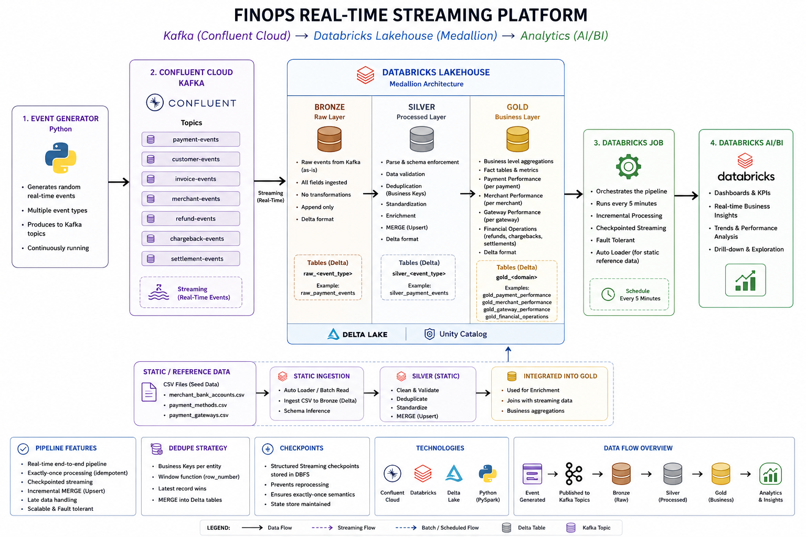

# FinOps Real-Time Streaming Platform

A production-style real-time data platform that ingests FinOps events from Kafka, processes them through Bronze → Silver → Gold Delta layers, and exposes business insights through Databricks AI/BI.

## Architecture



## Pipeline

```text
Python Event Generator
        ↓
Confluent Cloud Kafka
        ↓
Bronze → Silver → Gold
        ↓
Databricks AI/BI
```

### Event Generation

The controlled generator produces:

- Merchant
- Customer
- Invoice
- Payment
- Refund
- Chargeback
- Settlement

Example:

```python
EVENT_MODE = "NEW_BATCH"
NEW_LIFECYCLE_COUNT = 5
```

Generated IDs are UUID-style without semantic prefixes, and batches randomize amounts, statuses, timestamps, and source records. Events are published to seven Kafka topics. 

### Bronze

```text
dev.bronze.raw_events
```

Stores raw Kafka records with:

```text
topic
partition
offset
kafka_timestamp
raw_payload
```

Bronze uses Structured Streaming with `availableNow=True` and checkpointed Kafka offsets.

### Silver

Core tables:

```text
dev.silver.merchants
dev.silver.customers
dev.silver.invoices
dev.silver.payments
dev.silver.refunds
dev.silver.chargebacks
dev.silver.settlements
```

Flow:

```text
Bronze
  ↓
Parse → Flatten → Transform
  ↓
Data Quality
  ↓
Business-Key Deduplication
  ↓
Delta MERGE
```

Silver validates required fields and financial values, and deduplicates replayed events before MERGE.

### Gold

```text
dev.gold.payment_performance
dev.gold.merchant_performance
dev.gold.gateway_performance
dev.gold.financial_operations
```

Grain:

```text
payment_performance      → 1 row / payment
merchant_performance     → 1 row / merchant
gateway_performance      → 1 row / gateway
financial_operations     → 1 row / operation date
```

Gold updates only affected business keys instead of rebuilding all historical data.

## Incremental Processing

```text
Kafka → Bronze
        ↓ checkpoint
Bronze → Silver
        ↓ foreachBatch
Silver → Gold
        ↓ affected keys
```

Affected Gold keys include:

```text
payment_id
merchant_id
gateway_id
operation_date
```

This keeps each scheduled run incremental.

## Checkpoints

Examples:

```text
/Volumes/dev/stream/streaming_checkpoints/bronze_raw_events_v2
/Volumes/dev/stream/streaming_checkpoints/silver
/Volumes/dev/stream/streaming_checkpoints/gold_payment
```

Checkpoints preserve streaming state and Kafka progress so previously processed data is not reread on normal runs.

## Deduplication & Idempotency

Kafka offsets identify transport records; business keys identify business entities.

Within a microbatch, duplicate business keys are reduced to the latest record using Kafka timestamp, partition, and offset. Replayed events are handled through business-key MERGE, making Silver replay-safe.

## Data Quality

Silver checks:

```text
Required identifiers
Duplicate business records
Negative financial values
```

Critical validation failures stop the pipeline rather than silently producing invalid Gold data.

## Orchestration

Databricks Job:

```text
Kafka_Ingestion
      ↓
Silver_Processing_Kafka ───┐
                           ↓
Static_Ingestion → Silver_Processing_Static
                           ↓
                      Gold_Processing
```

The job runs every **5 minutes**; each streaming task processes the currently available data and completes.

## Static / Reference Data

Reference CSV data is ingested separately and used by Silver/Gold for enrichment. This branch includes merchant bank accounts, payment methods, payment gateways, payment attempts, and payment events.

## How to Run

### Configure Kafka

```text
KAFKA_BOOTSTRAP_SERVERS
KAFKA_API_KEY
KAFKA_API_SECRET
```

Never commit credentials to GitHub.

### Generate Events

Edit:

```text
event_generator/config/settings.py
```

Then:

```bash
python event_generator/main.py
```

The generator reports topic counts, total events, publishing time, and throughput.

### Run Databricks

The scheduled Job processes:

```text
Kafka → Bronze → Silver → Gold
```

Do not reset checkpoints during normal operation.

## Validation

### Bronze

```sql
SELECT topic, COUNT(*) AS event_count
FROM dev.bronze.raw_events
GROUP BY topic
ORDER BY topic;
```

### Silver grain

```sql
SELECT COUNT(*) AS rows,
       COUNT(DISTINCT payment_id) AS distinct_payments
FROM dev.silver.payments;
```

### Gold grain

```sql
SELECT COUNT(*) AS rows,
       COUNT(DISTINCT payment_id) AS distinct_payments
FROM dev.gold.payment_performance;
```

### Clean IDs

```sql
SELECT COUNT(*) AS bad_ids
FROM dev.gold.payment_performance
WHERE payment_id LIKE '%-batch-%';
```

Expected:

```text
0
```

fileciteturn9file0L540-L593

## Analytics

Databricks AI/BI consumes the Gold layer and provides:

- Payment Count
- Total Payment Amount
- Successful Payment Count
- Successful Payment Rate
- Payment Status Distribution
- Weekly Payment Volume
- Top Merchants by Payment Volume
- Gateway Performance
- Net Payment Trend
- Refund Amount
- Chargeback Amount

The analytics layer demonstrates how engineered Gold data becomes business insight.

## Screenshots

### Databricks Job


### Databricks AI/BI Dashboard


## Technology Stack

| Layer | Technology |
|---|---|
| Event Generation | Python |
| Streaming | Apache Kafka / Confluent Cloud |
| Processing | PySpark Structured Streaming |
| Lakehouse | Databricks + Delta Lake |
| Catalog | Unity Catalog |
| Orchestration | Databricks Jobs |
| Data Quality | PySpark validation |
| Analytics | Databricks AI/BI |
| Architecture | Medallion |

## Project Structure

```text
finops-streaming-platform/
├── databricks/notebooks/
├── event_generator/
├── streaming/
│   ├── bronze/
│   ├── silver/
│   └── gold/
├── tests/
├── docs/
├── pyproject.toml
└── README.md
```

## Engineering Highlights

- Incremental Kafka ingestion
- Checkpointed Structured Streaming
- Business-key deduplication
- Idempotent Delta MERGE
- Incremental Gold processing
- Data quality validation
- Scheduled orchestration
- Replay/recovery handling
- Business-ready Gold datasets
- Databricks AI/BI consumption 

## Validation Status

Tested with:

- Controlled event batches
- Kafka replay/reprocessing
- Same-batch duplicate keys
- Kafka topic recreation and checkpoint reset
- Large event batches
- Five-minute scheduled executions
- Gold grain validation
- Data quality failures and recovery

The final pipeline completed scheduled end-to-end runs successfully.

## Future Improvements

- Schema Registry
- Dead-letter queues
- Advanced Kafka partitioning
- Stronger data-quality quarantine
- More Gold domains
- Monitoring and alerting
- CI/CD for Databricks resources

## Author

**Hrithik**  
Cloud & Data Engineer
